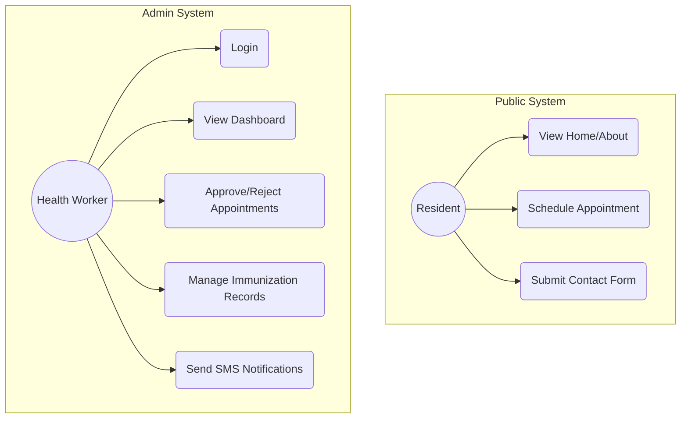

# Project Documentation: Barangay Immunization Notification System (BINS)

## 1. Introduction

### System Title
**Barangay Immunization Notification System (BINS)**

### Members and Roles
*   **[Member Name]** – Project Manager / Lead Developer
*   **[Member Name]** – UI/UX Designer / Frontend Developer
*   **[Member Name]** – Database Administrator / Backend Developer
*   *(Note: Please replace these placeholders with your actual team members and roles)*

### Overview of the System
The Barangay Immunization Notification System (BINS) is a digital healthcare platform designed to streamline and modernize the vaccination process within a local barangay. By providing an online interface for parents to schedule appointments and a robust management dashboard for health workers, BINS bridges the gap between manual record-keeping and efficient, technology-driven healthcare delivery.

---

## 2. Problem Statement

### What problem does the system solve?
Traditional barangay immunization processes often suffer from:
*   **Inefficient Scheduling**: Residents must visit the health center physically to inquire about availability, leading to long queues and wasted time.
*   **Manual Record-Keeping**: Paper-based records are susceptible to physical damage, loss, and are difficult to search or update quickly.
*   **Missed Vaccinations**: Parents often forget follow-up vaccination dates due to a lack of automated reminders.
*   **Data Fragmentation**: Information is scattered across various logbooks, making it difficult for health workers to track the overall health status of the community.

### Target Users
*   **Barangay Residents (Parents/Guardians)**: Primary users who need to schedule and track their children's immunizations.
*   **Barangay Health Workers (BHW)**: Administrative users who manage schedules, records, and notifications.
*   **Barangay Officials**: Stakeholders who oversee the general health programs of the community.

---

## 3. Objectives

### General Objective
To develop a centralized, web-based immunization management and notification system that improves the accessibility and efficiency of health services in the barangay.

### Specific Objectives
*   To provide an online scheduling portal for residents to book immunization slots from home.
*   To digitize immunization records for secure storage and rapid retrieval.
*   To implement an automated notification system via SMS and Email for appointment reminders.
*   To provide health workers with a dashboard for real-time monitoring of pending requests and community health data.

---

## 4. System Features

### Core Functionalities
*   **Online Appointment Booking**: A user-friendly form for parents to register infants and request preferred dates.
*   **Automated Notifications**: Integration with SMS and Email services to send confirmation and reminder alerts.
*   **Digital Record Management**: CRUD (Create, Read, Update, Delete) operations for immunization history.
*   **Secure Authentication**: Role-based access control to ensure data privacy and security.

### Key Modules
*   **Public Module**:
    *   *Landing Page*: Overview of services and "Protecting the Future" mission.
    *   *Scheduling*: Interactive form for appointment requests.
    *   *About/Contact*: Information about the system and ways to reach the health center.
*   **Admin Module**:
    *   *Dashboard*: Visual overview of appointment statistics.
    *   *Pending Appointments*: Interface for health workers to review, approve, or reject requests.
    *   *Immunization Records*: Centralized database of all vaccinated children and their history.
    *   *SMS Portal*: Dedicated center for sending broadcast or individual notifications.

---

## 5. System Design

### UML Diagrams

#### Use Case Diagram

#### System Architecture
BINS follows a modern **Client-Server Architecture** leveraging Cloud-native services:
*   **Frontend**: Angular SPA (Single Page Application) for a responsive and dynamic user experience.
*   **Backend as a Service (BaaS)**: Supabase provides PostgreSQL storage, Authentication, and Realtime capabilities.
*   **Integration Layer**: EmailJS and SMS APIs for outbound communications.

---

## 6. Live Demonstration

### Login and Navigation
*   **Admin Login**: Secure entry point for authorized personnel only.
*   **Sidebar Navigation**: Easy access to the Dashboard, Appointments, Records, and Notifications.

### Key Processes
1.  **Request Phase**: A parent fills out the "Schedule Appointment" form.
2.  **Review Phase**: The admin logs in, navigates to "Pending Appointments," and verifies vaccine availability before approving.
3.  **Action Phase**: Upon approval, the system triggers a notification to the parent.
4.  **Recording Phase**: After the vaccination is administered, the health worker updates the "Immunization Records" module to maintain a permanent digital history.

---

## 7. Tools & Technologies Used

*   **Programming Language**: TypeScript / JavaScript
*   **Frontend Framework**: Angular 21 (Latest)
*   **Styling**: Modern CSS3 with Flexbox/Grid and Glassmorphism aesthetics.
*   **Database & Auth**: Supabase (PostgreSQL).
*   **API Integrations**: 
    *   *EmailJS*: For transactional email alerts.
    *   *SMS Gateway*: For direct mobile notifications.
*   **UI Components**: SweetAlert2 for polished user feedback and alerts.

---

## 8. Challenges Encountered

### Problems Faced and Solutions Applied
*   **Real-time Data Sync**: Synchronizing local UI state with the Supabase backend was initially challenging. *Solution*: Implemented RxJS-based services and Supabase Realtime subscriptions to ensure the UI updates instantly.
*   **Mobile Responsiveness**: Designing a complex admin dashboard for small screens. *Solution*: Utilized CSS Media Queries and flexible layouts to ensure accessibility across all devices.
*   **State Management**: Handling complex appointment statuses (Pending, Approved, Completed). *Solution*: Developed a robust service layer to centralize data logic.
*   *(Note: Please add any specific technical or personal challenges you faced during this project)*

---

## 9. Conclusion & Recommendations

### Conclusion
The Barangay Immunization Notification System effectively transforms a traditionally manual process into a streamlined digital workflow. By centralizing data and automating communications, the system reduces the administrative burden on health workers and provides a more convenient experience for residents, ultimately contributing to higher immunization rates in the community.

### Recommendations
*   **Mobile Application**: Develop a native mobile app for Android and iOS to provide push notifications.
*   **Inventory Tracking**: Integrate a vaccine inventory module to track stock levels and expiration dates automatically.
*   **Offline Support**: Implement Progressive Web App (PWA) features to allow health workers to access records in areas with poor internet connectivity.
